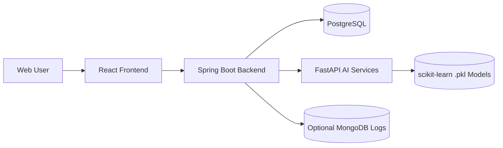

# FitSense Architecture Diagram

## Service Responsibilities
- Frontend: auth UI, dashboard, daily metrics forms, charts, and feedback capture.
- Backend: JWT auth, API orchestration, persistence, session context, AI routing.
- AI services: fitness profile, readiness, adaptive plan, progress estimation, feedback adaptation.
