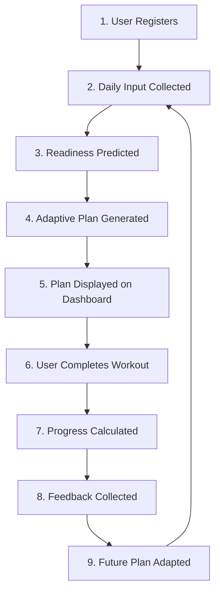

# Daily Adaptation Flow

```mermaid
flowchart TD
    A[1. User Registers] --> B[2. Daily Input Collected]
    B --> C[3. Readiness Predicted]
    C --> D[4. Adaptive Plan Generated]
    D --> E[5. Plan Displayed on Dashboard]
    E --> F[6. User Completes Workout]
    F --> G[7. Progress Calculated]
    G --> H[8. Feedback Collected]
    H --> I[9. Future Plan Adapted]
    I --> B
```
